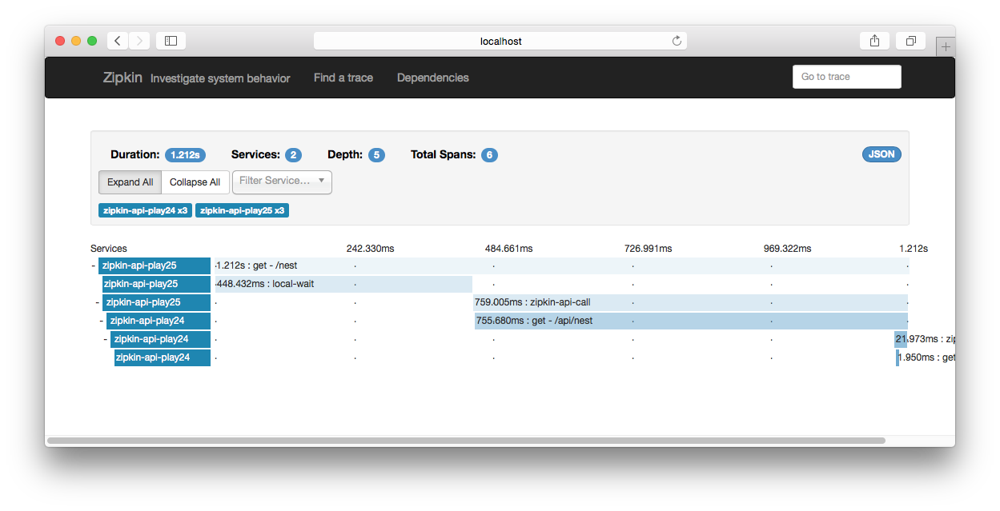

play-zipkin-tracing [](https://travis-ci.org/bizreach/play-zipkin-tracing)
========

Provides distributed tracing for Play Framework using [Zipkin](https://zipkin.io/). It makes possible to trace HTTP calls between Play based microservices easily without performance degradation.

## Supported versions

- [Akka 2.5.x](play-zipkin-tracing/akka/README.md) (Zipkin1 and Zipkin2 support are available)
- [Play 2.7](play-zipkin-tracing/play/README.md) (Zipkin1 and Zipkin2 support are available)

## Old versions (currently unsupported)

- [Play 2.6](https://github.com/bizreach/play-zipkin-tracing/blob/2.1.0/play-zipkin-tracing/play/README.md) (Zipkin1 and Zipkin2 support are available)
- [Play 2.5](https://github.com/bizreach/play-zipkin-tracing/blob/1.2.0/play-zipkin-tracing/play25/README.md) (only Zipkin1 support is available)
- [Play 2.4](https://github.com/bizreach/play-zipkin-tracing/blob/1.2.0/play-zipkin-tracing/play24/README.md) (only Zipkin1 support is available)
- [Play 2.3](https://github.com/bizreach/play-zipkin-tracing/blob/1.2.0/play-zipkin-tracing/play23/README.md) (only Zipkin1 support is available)

## Sample projects

- [zipkin-akka-actor](https://github.com/bizreach/play-zipkin-tracing/tree/master/sample/zipkin-akka-actor) (Zipkin2)
- [zipkin-api-play27](https://github.com/bizreach/play-zipkin-tracing/tree/master/sample/zipkin-api-play27) (Zipkin2)
- [zipkin-api-play26](https://github.com/bizreach/play-zipkin-tracing/tree/master/sample/zipkin-api-play26) (Zipkin2)
- [zipkin-api-play25](https://github.com/bizreach/play-zipkin-tracing/tree/master/sample/zipkin-api-play25) (Zipkin1)
- [zipkin-api-play24](https://github.com/bizreach/play-zipkin-tracing/tree/master/sample/zipkin-api-play24) (Zipkin1)
- [zipkin-api-play23](https://github.com/bizreach/play-zipkin-tracing/tree/master/sample/zipkin-api-play23) (Zipkin1)

### How to run sample projects

1. Run zipkin-api-play27 project

  ```
  $ cd sample/zipkin-api-play27
  $ sbt run
  ```

2. Run zipkin-api-play24 project

  ```
  $ cd sample/zipkin-api-play24
  $ sbt run
  ```

3. Run Zipkin UI

  ```
  $ java -jar zipkin.jar
  ```

4. Hit http://localhost:9991/nest in some way

  ```
  $ curl http://localhost:9991/nest
  ```

Then you can see traced data on Zipkin UI (http://localhost:9411) as:


